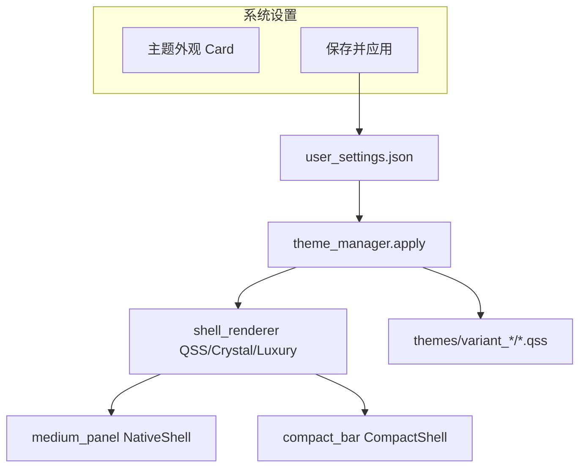

# HAJIMI 实训 DAY4 工作内容（v2）

> **日期**：实训第 4 天（对照 [`HAJIMI-六天冲刺计划.md`](HAJIMI-六天冲刺计划.md) Day 4 + Native UI 深化）  
> **角色**：B 端（前端 / 桌面应用）为主  
> **文档版本**：v2 · 2026-07-02（补录）

---

## 一、DAY4 目标

| 路线阶段 | 天数 | DAY4 对应里程碑 |
|----------|------|-----------------|
| **六天计划 Day 4** | 第 4 天 | 红线检测、L2 快路径、管理面板完善、挂件交互完整 |
| **B 端实际重点** | 第 4 天 | **Native UI 主题体系** + **双态窗口** + **布局/样式分离** + **轻奢主题试验入生产** |

**DAY4 核心目标**（B 端已实现部分）：

1. 生产路径全面切换为 PyQt Native（`USE_NATIVE_UI=1`），WebEngine 可回退  
2. 中窗 / 小窗双态：自由缩放、胶囊折叠、自动模式切换  
3. 主题系统：`current` / `variant_b` / `variant_c` / `variant_luxury`，设置页可保存  
4. 顶栏、气泡、InputFloat 等视觉对齐 HTML 设计母版  

---

## 二、DAY4 任务清单

### 2.1 B 端 — 布局与样式分离（Round 7–8）

| # | 任务 | 涉及文件 | 状态 |
|---|------|----------|------|
| 1 | `layout_tokens.py` + `visual_tokens.py` 拆分 | `ui/native/` | ✅ |
| 2 | `themes/current|variant_b|variant_c/` 组合 QSS | `ui/native/themes/` | ✅ |
| 3 | `theme_manager.py` 注册 shell + apply | `ui/native/theme_manager.py` | ✅ |
| 4 | UI 协作规范文档 | `docs/UI协作规范.md` | ✅ |
| 5 | `sync_design_tokens.py` 校验脚本 | `scripts/sync_design_tokens.py` | ✅ |

### 2.2 B 端 — 双态窗口与动效

| # | 任务 | 涉及文件 | 状态 |
|---|------|----------|------|
| 1 | 中窗 8 向边缘拖拽缩放（remember size） | `ui/native/resize_grip.py`, `main_widget.py` | ✅ |
| 2 | 小窗 320×52 胶囊 + 水平 320–420 缩放 | `ui/native/compact_bar.py` | ✅ |
| 3 | 模式切换动画（fade + bottom-right 锚定） | `ui/native/motion.py` | ✅ |
| 4 | 窗口状态持久化 | `ui/native/window_state.py` | ✅ |
| 5 | 步骤产出 → 中窗；任务完成 → 小窗 | `ui/app_controller.py` | ✅ |
| 6 | Enter 提交 / Shift+Enter 换行 | `ui/native/medium_panel.py` | ✅ |

### 2.3 B 端 — 主题外观与轻奢

| # | 任务 | 涉及文件 | 状态 |
|---|------|----------|------|
| 1 | Shell QSS / Crystal 互斥渲染 | `ui/native/shell_renderer.py` | ✅ |
| 2 | 设置页主题外观 Card（保存并应用） | `ui/native/medium_panel.py` | ✅ |
| 3 | 顶栏艺术字三种模式 | `ui/native/title_art.py` | ✅ |
| 4 | 轻奢 A/B/C Demo 对比 | `ui/style_preview_demo.py` | ✅ |
| 5 | 生产 `variant_luxury`：星空 + 鎏金签名 | `ui/native/luxury/` | ✅ |
| 6 | 轻奢侧栏 glass NavDrawer + 721 icons | `ui/native/luxury/icons.py` | ✅ |
| 7 | 设置即时预览（未保存可预览轻奢） | `medium_panel.apply_appearance` | ✅ |

### 2.4 B 端 — 顶栏与状态 chrome

| # | 任务 | 涉及文件 | 状态 |
|---|------|----------|------|
| 1 | StatusBadge 合并 idle / error / processing | `ui/native/medium_panel.py` | ✅ |
| 2 | `compute_topbar_min_width` 动态 narrowMin | `ui/native/layout/topbar_layout.py` | ✅ |
| 3 | 窄窗仅 HAJIMI，宽窗显示 `· 操作指引` | `_update_panel_sub_visibility` | ✅ |
| 4 | processing 呼吸灯 | `ui/native/status_badge_fx.py` | ✅ |

### 2.5 A/C 端（六天计划 Day 4 · 部分延后）

| # | 任务 | 说明 | 状态 |
|---|------|------|------|
| 1 | 红线检测接入 process 最前端 | A 端 `redline_service` | ⏳ Demo 阶段可 Mock |
| 2 | L2 快路径 < 3s | A 端离线规则 | ⏳ |
| 3 | Web 管理面板 5 页对接真实 API | C 端 | ⏳ Day 4 原计划 |
| 4 | `/api/admin/*` 全面对接 | A + C | ⏳ |

---

## 三、DAY4 交付物

| 交付物 | 路径 |
|--------|------|
| DAY4 工作总结 | `docs/DAY4-工作内容_v2.md`（本文档） |
| 设计 spec（Round 8–13） | `docs/design-spec.md` |
| UI 协作规范 | `docs/UI协作规范.md` |
| 主题验证脚本 | `scripts/verify_theme_apply.py` |
| 样式预览 Demo | `ui/style_preview_demo.py` |
| 窗口状态持久化 | `ui/native/window_state.py` |
| 轻奢共享模块 | `ui/native/luxury/` |

---

## 四、DAY4 验收标准

### 4.1 B 端必须通过

1. `python main.py` → Native 中窗 400×520（或记忆尺寸），8 向可缩放  
2. 任务完成或手动切换 → 小窗 320×52 胶囊，左右可拖 320–420  
3. 设置 → 主题外观 → 切换 variant_b / variant_c / 黑金轻奢 → 保存并应用 → 顶栏 accent / 壳层变化  
4. `python scripts/verify_theme_apply.py` 通过  
5. `set HAJIMI_NATIVE_UI=0` → WebEngine 仍可启动（回退路径）

### 4.2 六天计划 Day 4 原验收（跨端 · 部分待完成）

- [ ] 红线「帮我抢票」被拒  
- [ ] L2 简单指令 < 3s  
- [ ] 管理面板 5 页真实数据  
- [x] 挂件折叠/拖拽/resize/置顶（B 端 Native 已实现）

---

## 五、架构示意（DAY4 主题系统）



---

## 六、快速命令参考

```powershell
# 生产 Native
python main.py

# 主题切换自动化验证
python scripts\verify_theme_apply.py

# 设计试验 Demo（非生产）
python -m ui.style_preview_demo

# Web 回退
set HAJIMI_NATIVE_UI=0
python main.py

# Token 与设计母版对照
python scripts\sync_design_tokens.py
```

---

## 七、DAY4 工作日志模板（提交实训用）

```markdown
### 日期：____年__月__日（DAY4）

**今日完成**
- 双态窗口 / 主题系统 / 轻奢入生产
- 

**遇到的问题与解决**
- 

**与 A / C 联调情况**
- 

**明日计划（DAY5）**
- 集成测试 + Bug 清单

**截图/录屏**（可选）
- 中窗缩放 + 小窗胶囊
- 轻奢主题设置页
```

---

## 八、DAY5 计划（预览）

> **详见**：[`DAY5-工作内容_v2.md`](DAY5-工作内容_v2.md)

| 优先级 | 任务 | 说明 |
|--------|------|------|
| P0 | `verify_integration` + 真实桌面框位置人工验收 | 全链路 |
| P0 | GPU 内网模式端到端 | 校园容器 + B 内网设置 |
| P1 | `/clarify` UI、`/step` 挂起完整体验 | 待接入 |
| P2 | C 端 ASR 信号 | `b-c-api-contract.md` |

---

## 九、参考文档

- DAY3 基线：[`DAY3-工作内容_v2.md`](DAY3-工作内容_v2.md)
- 设计 spec：[`design-spec.md`](design-spec.md)
- UI 协作：[`UI协作规范.md`](UI协作规范.md)
- 六天冲刺：[`HAJIMI-六天冲刺计划.md`](HAJIMI-六天冲刺计划.md)
