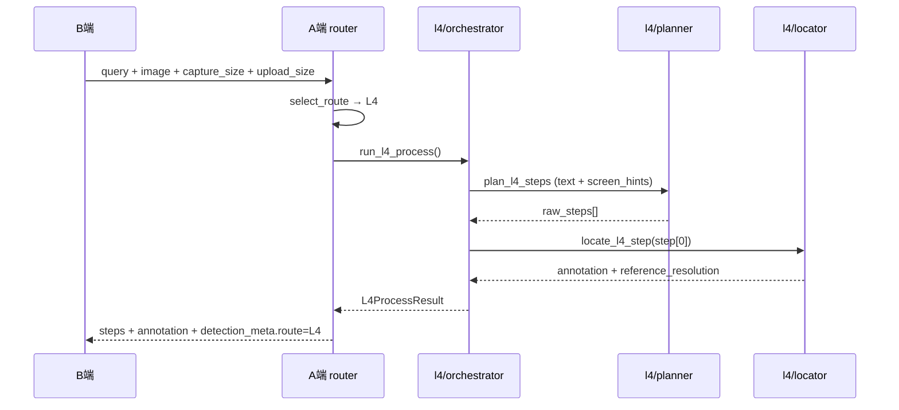

# L4 Vision 快路径 — 技术说明

## 1. 概述

L4 是 HAJIMI 的 **Vision 直连快路径**，参考 OpenGuider 架构：跳过 OmniParser，由 Vision LLM 输出归一化坐标 `[POINT:x,y:label]`，逐步定位 UI 元素。

**设计原则**

- 与 L1/L2/L3 **完全解耦**：独立包 `server/services/l4/`，不修改 OmniParser 与 L3 规划链
- L3_DEFERRED 仍走原有 `server/services/vision/` 模块
- 仅当 `route_selector` 选出 `L4` 时进入本路径

## 2. 路由关系

| 路由 | OmniParser | Planner | Locator | 典型场景 |
|------|------------|---------|---------|----------|
| L2 | 跳过 | 模板 | 无 | 截图/快捷键等固定 SOP |
| L3 | **是** | LLM + 元素列表 | 元素绑定 | `ROUTING_MODE=precision` |
| L3_DEFERRED | 跳过（逐步） | `vision/planner` | `vision/locator` | `ROUTING_MODE=balanced` |
| **L4** | **跳过** | **`l4/planner`** | **`l4/locator`** | `auto` / `fast` 默认 |

路由入口：`server/services/planning/route_selector.py`  
L4 编排：`server/services/l4/orchestrator.py`

## 3. 模块结构

```
server/services/l4/
├── __init__.py          # 导出 run_l4_process / run_l4_locate_step
├── config.py            # L4 专用 env 配置
├── types.py             # L4ScreenContext / L4ProcessResult
├── orchestrator.py      # process + locate 编排
├── planner.py           # 纯文本计划（默认不传全图）
├── locator.py           # Vision 单步定位 + strict retry
├── llm_client.py        # 独立 LLM 客户端（不走 L3 speed_mode 链）
├── point_parser.py      # [POINT:x,y:label] 解析
├── calibration.py       # upload 空间 → capture 空间坐标映射
├── pipeline.py          # Pre: screen_hints / UIA；Post: strict 校验
└── image_utils.py       # Base64 清洗
```

## 4. 处理流程

### 4.1 `/api/demo/process`（首次请求）



### 4.2 步骤推进 `/api/demo/step` 与 `/api/demo/locate`

- 当 `task.route_mode == "L4"` 时，advance/locate/relocate 调用 `locate_l4_step`
- L3_DEFERRED 仍使用 `locate_step_with_vision`（vision 模块）

## 5. 坐标系与校准

1. **Locator 出点空间**：Vision 模型看到的 **upload 图**（降采样后，如 720px 长边）
2. **归一化**：x,y ∈ [0, 1000]，相对 upload 宽高
3. **映射到 overlay**：若 B 端提供 `capture_size`（原始截图尺寸），`calibration.py` 将 annotation 线性缩放到 capture 空间
4. **reference_resolution**：返回 `[capture_w, capture_h]`，供 B 端 `coordinate_mapper` / `overlay_coords` 映射到逻辑屏幕

B 端需传递：

```json
{
  "capture_size": [1920, 1080],
  "upload_size": [720, 405],
  "screen_metrics": { "logical_w": 1920, "logical_h": 1080, "dpr": 1.0 }
}
```

## 6. 配置项（server/.env）

| 变量 | 默认 | 说明 |
|------|------|------|
| `ROUTING_MODE` | `auto` | `fast` 强制 L4；`precision` 走 L3 |
| `L4_PLANNER_MODEL` | `DEEPSEEK_MODEL` | 纯文本 Planner |
| `L4_LOCATOR_MODEL` | `LLM_MODEL` | Vision Locator |
| `L4_PLANNER_USE_VISION` | `false` | Planner 是否带图 |
| `L4_PIPELINE_ENABLED` | `true` | 启用 screen_hints / UIA Pre |
| `L4_STRICT_LOCATE` | `true` | 无 [POINT] 时自动 retry |
| `L4_SCREEN_HINTS` | `true` | 注入分辨率/窗口标题 |
| `L4_PLANNER_TIMEOUT` | `15` | Planner 超时（秒） |
| `L4_LOCATOR_TIMEOUT` | `45` | Locator 超时（秒） |

## 7. B 端配合

| 能力 | 文件 | 说明 |
|------|------|------|
| 路由感知预检 | `core/api_client.py` | L4 路径仅检 A 端 + LLM；inspect/precision 仍检 OmniParser |
| ROUTING_MODE 同步 | `core/env_sync.py` | UI 快速/平衡/精准 → server/.env |
| 截图缓存 900ms | `core/screen_utils.py` | `capture_screen_cached()` + in-flight 去重 |
| 传递屏幕上下文 | `core/api_client.py` | process/step/locate/relocate 携带 capture/upload/metrics |
| L4-only 启动 | `scripts/start_l4_demo.bat` | 无需 :9800 隧道 |

**运行指南**：[L4-真实环境运行指南.md](./L4-真实环境运行指南.md)

## 8. 与 L3 的边界

- **不修改**：`omniparser_client.py`、`vision/`（L3_DEFERRED）、L2 模板、L3 OmniParser 分支
- **router.py 改动**：仅 `route == "L4"` 分支委托 `l4.orchestrator`；`L3_DEFERRED` 分支保持原样
- **独立 LLM 客户端**：L4 不经过 `server/services/llm/client.py` 的 speed_mode 降级链，便于单独调 Planner/Locator 模型

## 9. 延迟观测

`detection_meta.latency_breakdown` 字段：

- `plan_ms`：L4 Planner
- `locate_ms`：首步 / 逐步 Locator
- `parse_ms`：L4 恒为 0（`parse_skipped: true`）

## 10. 测试

```bash
cd server
python -m pytest tests/test_l4.py tests/test_routing.py -q
```

## 11. 后续扩展（未纳入本次）

- SSE 流式 process 反馈
- Playwright BROWSER 执行层
- 用户触发的 L4→L3 混合精修模式
- 基于 latency_breakdown 的自动路由调参
