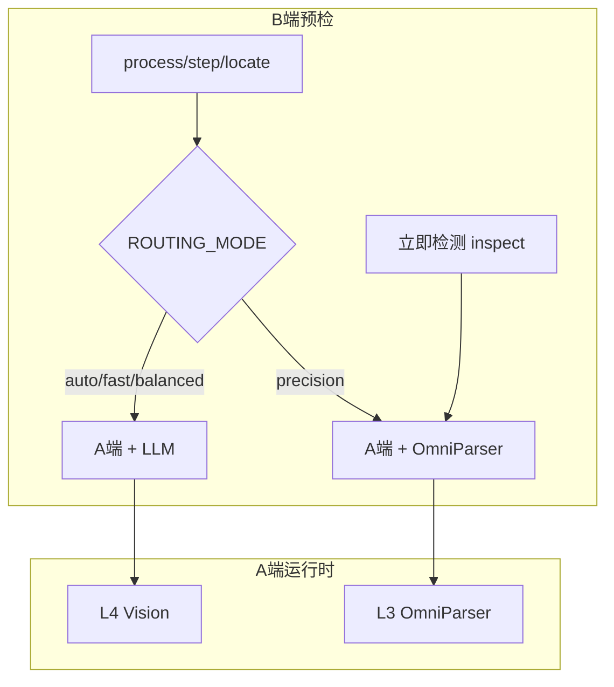

# L4 真实环境运行指南

> 面向使用者与联调同学：从零跑通 L4 Vision 快路径。  
> 技术细节见 [L4-Vision快路径-技术说明.md](./L4-Vision快路径-技术说明.md)。

---

## 1. 核心概念

| 概念 | 说明 |
|------|------|
| **L4 运行时** | 跳过 OmniParser，仅用 LLM（Planner 文本 + Locator Vision） |
| **process 预检（解耦后）** | `ROUTING_MODE=auto/fast/balanced` 时只需 **A 端 :8010 + LLM** |
| **inspect 预检** | 始终需要 **OmniParser**（与 L4 任务无关） |
| **精准模式** | `ROUTING_MODE=precision` → 走 L3 OmniParser，process 预检仍要求 OmniParser |



---

## 2. 前置条件

- Python 3.10+，已运行 `scripts\setup.bat` 与 `scripts\setup_server_env.bat`
- `server/.env` 中配置 LLM（Vision Locator 必须支持识图）
- Windows 10+（官方支持平台）

### 最小 LLM 配置（server/.env）

```env
ROUTING_MODE=auto

LLM_API_KEY=sk-你的key
LLM_BASE_URL=https://你的中转/v1
LLM_MODEL=gpt-4o          # 或 gemini-2.0-flash 等 vision 模型

L4_PLANNER_MODEL=deepseek-chat
L4_LOCATOR_MODEL=gpt-4o
L4_PLANNER_USE_VISION=false

HAJIMI_DEMO_KEY=hajimi-demo-2026
HAJIMI_PORT=8010
```

---

## 3. 三种部署模式

| 模式 | 启动命令 | L4 任务 | inspect / 精准 |
|------|----------|---------|----------------|
| **L4-only（推荐验证 L4）** | `scripts\start_l4_demo.bat` | 是 | 否（需另启 OmniParser） |
| **GPU API** | `scripts\start_gpu_one_click.bat` | 是 | 是（:9800 隧道） |
| **本地 CPU** | `scripts\start_all.bat` | 是 | 是（慢，2–4 min/帧） |

### 3.1 L4-only 最快路径

```powershell
cd E:\University\greed3-2\Shixun\HAJIMI_UI

# 1. 编辑 server\.env（LLM + ROUTING_MODE=auto）
# 2. 一键启动（不检查 :9800 隧道）
scripts\start_l4_demo.bat
```

脚本行为：

- 只启 A 端 `:8010` + B 端 UI
- 等待 `/api/demo/health/live` 就绪
- **不**要求 OmniParser 隧道

### 3.2 GPU API 全功能

```powershell
scripts\start_gpu_one_click.bat
```

需 SSH 隧道 `:9800` 指向远程 GPU OmniParser。L4 任务仍走 Vision，inspect 走 GPU parse。

### 3.3 本地 CPU 全功能

```powershell
scripts\start_all.bat
```

需本地 `OmniParser/` 权重与 `:8002` 服务。

---

## 4. UI 设置与路由同步

打开 **系统设置** 面板：

### 指引路由

| UI 选项 | 路由 | 说明 |
|---------|------|------|
| **快速** | L4 | Vision 快路径，无需 OmniParser |
| **平衡** | L3_DEFERRED | 先 plan，每步 Vision 定位 |
| **精准** | L3 | OmniParser 全屏检测 |

### L4 Vision 模型（快速/平衡模式下可编辑）

| 设置项 | 对应 env | 说明 |
|--------|----------|------|
| L4 Planner 模型 | `L4_PLANNER_MODEL` | 留空 → DeepSeek 文本规划 |
| L4 Locator 模型 | `L4_LOCATOR_MODEL` | 留空 → 使用「问答模型名」，须支持 Vision |
| Planner 传截图 | `L4_PLANNER_USE_VISION` | 默认关，省 token |
| Strict 定位 | `L4_STRICT_LOCATE` | 无坐标时自动重试 |
| 轻量 Pipeline | `L4_PIPELINE_ENABLED` | 屏幕摘要 + UIA 提示 |

保存后会写入 `server/.env` 并重启 A 端（本地 / GPU API 模式）。

---

## 5. 逐步跑通 L4 任务

1. 启动服务（推荐 `scripts\start_l4_demo.bat`）
2. 确认健康检查：

   ```powershell
   curl http://127.0.0.1:8010/api/demo/health/live
   curl http://127.0.0.1:8010/api/demo/health
   ```

   `/health` 应包含：

   ```json
   {
     "status": "ok",
     "routing_mode": "auto",
     "llm_configured": true,
     "l4_capable": true
   }
   ```

3. 打开 HAJIMI UI，系统设置 → A 端 `http://127.0.0.1:8010` → 保存
4. 打开有 UI 的窗口（Word、设置、浏览器等）
5. 输入**多步、非模板**问题，例如：
   - `帮我在 Word 里设置页边距`
   - `怎么把当前窗口最大化`
6. 提交后观察进度，成功时应显示 `route=L4`

---

## 6. 验证 L4 的 5 个信号

| # | 信号 | 预期 |
|---|------|------|
| 1 | UI 完成提示 | `route=L4` |
| 2 | `detection_meta.omniparser_skipped` | `true` |
| 3 | `latency_breakdown.parse_ms` | `0` 或极小 |
| 4 | A 端控制台 | `L4 LLM planner` / `L4 LLM locator` |
| 5 | 总耗时 | 通常 5–20s（无 parse 等待） |

---

## 7. curl / Python 直连测试

```powershell
cd E:\University\greed3-2\Shixun\HAJIMI_UI
python -c "
import base64, json
from pathlib import Path
import httpx

img_path = Path('test_screenshot.png')
if not img_path.exists():
    print('请在项目根目录放一张 test_screenshot.png')
    raise SystemExit(1)

raw = img_path.read_bytes()
b64 = base64.b64encode(raw).decode()
w, h = 1920, 1080

r = httpx.post(
    'http://127.0.0.1:8010/api/demo/process',
    headers={'X-Demo-Key': 'hajimi-demo-2026'},
    json={
        'query': '帮我在当前窗口找到保存按钮',
        'image': f'data:image/jpeg;base64,{b64}',
        'capture_size': [w, h],
        'upload_size': [720, int(720 * h / w)],
        'screen_metrics': {'logical_w': w, 'logical_h': h, 'dpr': 1.0},
    },
    timeout=120,
)
data = r.json()
meta = data.get('detection_meta') or {}
print('success:', data.get('success'))
print('route:', meta.get('route'))
print('omniparser_skipped:', meta.get('omniparser_skipped'))
print('latency:', meta.get('latency_breakdown'))
print('steps:', len(data.get('steps') or []))
"
```

---

## 8. 步骤推进与重新定位

- **下一步**：B 端自动截图（900ms 缓存）→ `/api/demo/step` → L4 Locator 定位下一步
- **重新定位**：`/api/demo/relocate` → 同样走 L4 Locator（当 `route_mode=L4`）
- L4 模式下 advance/locate/relocate **不再**要求 OmniParser 预检

---

## 9. 常见问题

| 现象 | 原因 | 处理 |
|------|------|------|
| 截图前就报 OmniParser 未就绪 | `ROUTING_MODE=precision` 或旧版 B 端 | 改 `ROUTING_MODE=auto`，或用 `start_l4_demo.bat` |
| `route=L3` | 精准模式或 L2 模板命中 | 改快速模式；换非模板多步问题 |
| `route=L2` | 问了「怎么截图」等固定 SOP | 换需要看屏幕的任务 |
| LLM 401 / timeout | Key 或模型无 vision | 检查 `L4_LOCATOR_MODEL` |
| 标注位置偏移 | capture_size 未传 | 使用最新 B 端（已自动传递） |
| inspect 失败但 L4 正常 | 预期行为 | inspect 独立需要 OmniParser；L4 任务不受影响 |
| `/health` 中 `l4_capable=false` | LLM 未配置 | 补全 `LLM_API_KEY` + `LLM_BASE_URL` |

---

## 10. 与 inspect / 精准模式共存

同一 A 端可同时支持：

- **L4 任务**：`ROUTING_MODE=auto` + LLM → 无需 OmniParser
- **立即检测**：单独走 inspect 预检 → 需要 OmniParser
- **精准指引**：UI 切「精准」→ `ROUTING_MODE=precision` → process 恢复 OmniParser 预检

推荐日常开发：**L4-only 跑任务**，需要 inspect 时再启 GPU 隧道或本地 OmniParser。

---

## 11. 相关文件

| 文件 | 作用 |
|------|------|
| [`core/api_client.py`](../core/api_client.py) | 路由感知预检 |
| [`core/routing_config.py`](../core/routing_config.py) | 读取 ROUTING_MODE |
| [`core/env_sync.py`](../core/env_sync.py) | UI 设置 → server/.env |
| [`scripts/start_l4_demo.bat`](../scripts/start_l4_demo.bat) | L4-only 启动 |
| [`server/services/l4/`](../server/services/l4/) | L4 实现 |

---

## 12. 测试

```powershell
python -m pytest server/tests/test_preflight.py server/tests/test_l4.py server/tests/test_routing.py -q
```
